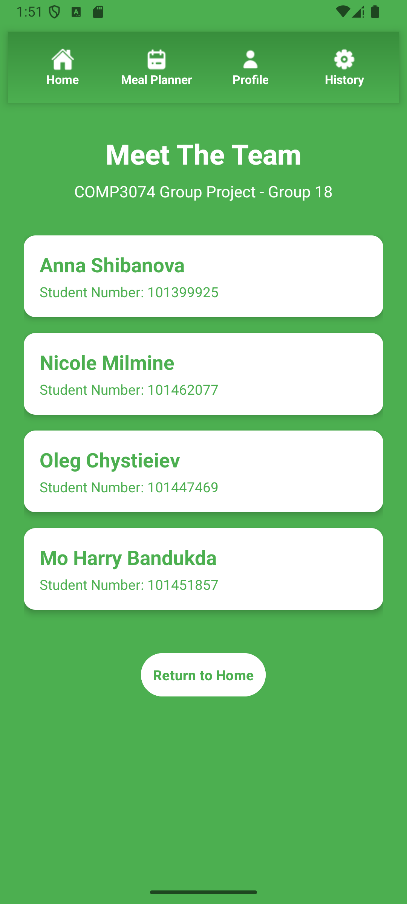
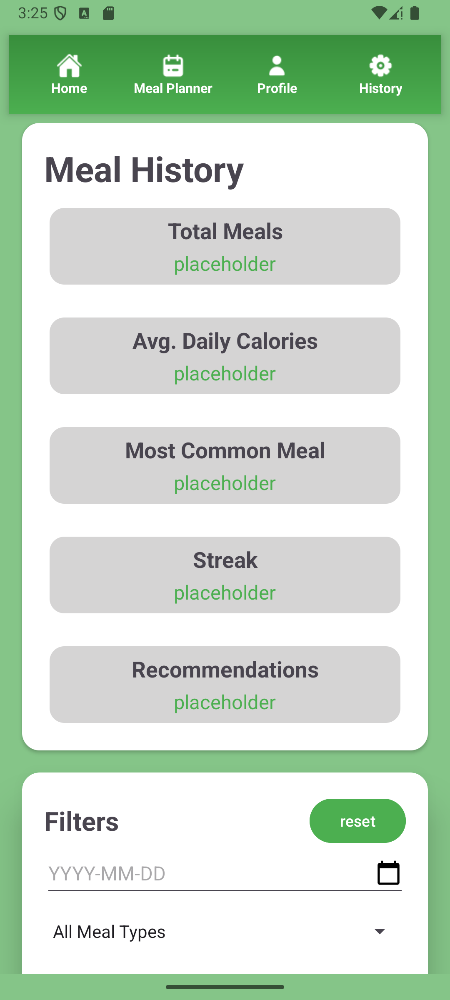
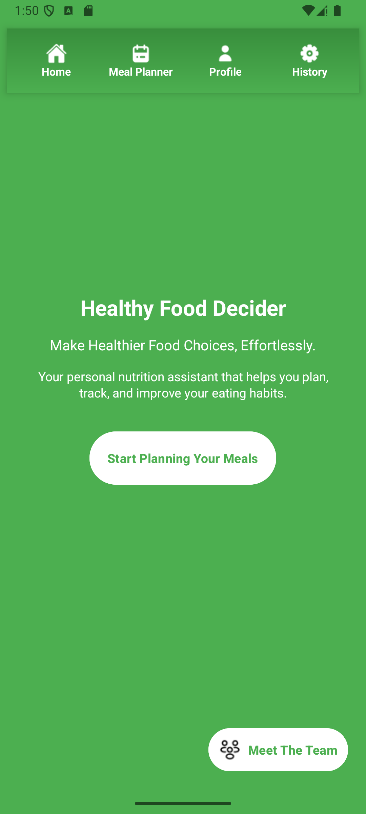
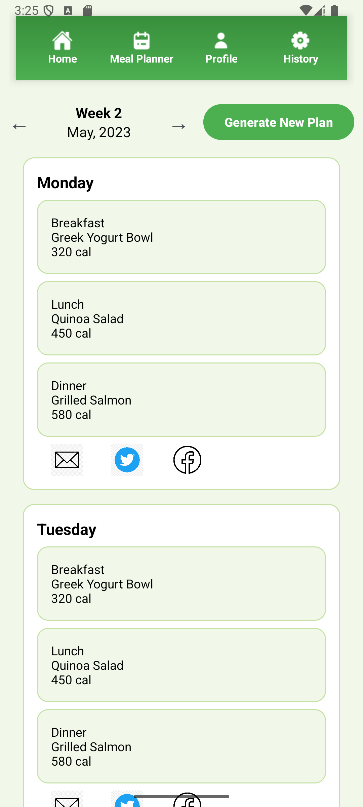
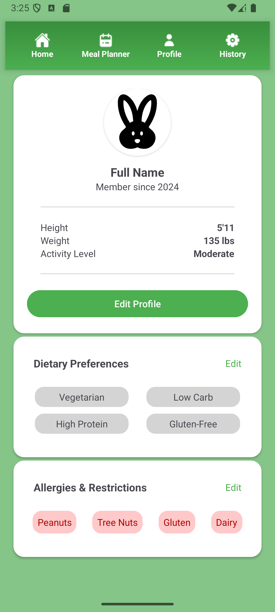

# **COMP3074 Group Project - Group 18**

## 👥 **Project Team Members**

| **Name**          | **Student Number** |
|-------------------|--------------------|
| Anna Shibanova    | 101399925         |
| Oleg Chystieiev   | 101447469         |
| Nicole Milmine    | 101462077         |
| Mo Harry Bandukda | 101451857         |

---

## 📱 **Screenshots and Features**

### **1. About Screen**
<table>
<tr>
<td>

</td>
<td>
Provides an overview of the app, its purpose, and key features.
</td>
</tr>
</table>

---

### **2. Edit Profile Screen**
<table>
<tr>
<td>

</td>
<td>
Allows users to update their personal details effortlessly.
</td>
</tr>
</table>

---

### **3. History Screen**
<table>
<tr>
<td>

</td>
<td>
Displays the user's previous interactions and meal plans for easy tracking.
</td>
</tr>
</table>

---

### **4. Homepage**
<table>
<tr>
<td>

</td>
<td>
The central hub with quick access to all main features.
</td>
</tr>
</table>

---

### **5. Meal Plan Screen**
<table>
<tr>
<td>

</td>
<td>
Generates and showcases personalized meal plans tailored to the user's preferences.
</td>
</tr>
</table>

---

### **6. Profile Screen**
<table>
<tr>
<td>

</td>
<td>
A personalized dashboard with user details and app settings.
</td>
</tr>
</table>

---

### **7. Splash Screen**
<table>
<tr>
<td>

</td>
<td>
Welcomes users with an engaging startup animation for a smooth first impression.
</td>
</tr>
</table>

---

## 🚀 **Current Status**

- A fully functional **navigation system** ensures seamless transitions between screens.
- The **Facebook share button** is successfully inteegrated and operational, enabling users to share their meal plans directly.

---

> **📌 Note to Professor:**  
> This project demonstrates our commitment to delivering a feature-rich and user-friendly app. Future updates are planned to enhance its functionality further.

---
