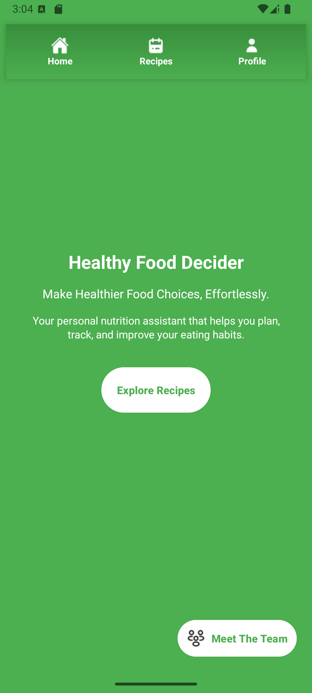

# **COMP3074 Group Project - Group 18**

## 👥 **Project Team Members**

| **Name**          | **Student Number** |
|-------------------|--------------------|
| Anna Shibanova    | 101399925         |
| Oleg Chystieiev   | 101447469         |
| Nicole Milmine    | 101462077         |
| Mo Harry Bandukda | 101451857         |

---

## 📱 **Screenshots and Features**

### **1. Splash Screen**
<table>
<tr>
<td>

</td>
<td>
Welcomes users with an engaging startup animation for a smooth first impression. The splash screen sets the tone for the app with its minimalist design and seamless transition into the homepage, ensuring users feel invited from the moment they open the app.
</td>
</tr>
</table>

---

### **2. Homepage**
<table>
<tr>
<td>

</td>
<td>
The central hub with quick access to all main features, including exploring recipes, managing meal plans, and checking your profile or history. Users can discover a variety of recipes tailored to their preferences and search using tags for specific cuisines or meal types. Powered by the Spoonacular API, the homepage provides a dynamic, real-time feed of trending recipes and meal ideas.
</td>
</tr>
</table>

---

### **3. Discover Recipes Screen**
<table>
<tr>
<td>

</td>
<td>
Discover an extensive collection of recipes, filtered by user-selected tags such as cuisine, dietary preferences, or meal type. This screen fetches real-time recipe data from the Spoonacular API and displays it using `RecyclerView` with a custom adapter. Users can browse recipes with a visually engaging layout, ensuring an intuitive and enjoyable discovery experience.
</td>
</tr>
</table>

---

### **4. Search Tag**
<table>
<tr>
<td>

</td>
<td>
Search tags provide an organized way for users to find recipes based on categories like breakfast, vegetarian, keto, and more. The app uses a user-friendly `Spinner` dropdown menu for selecting tags, which then sends the query to the Spoonacular API via Retrofit. The result is a smooth and interactive search experience that quickly connects users to their desired recipes.
</td>
</tr>
</table>

---

### **5. Recipes Details**
<table>
<tr>
<td>

</td>
<td>
Provides comprehensive details about each recipe, including ingredients, cooking instructions, nutritional information, and the recipe's author. This screen is powered by the Spoonacular API, with data fetched using Retrofit and displayed dynamically through a `RecyclerView.Adapter`. It ensures users have all the information they need to prepare their favorite meals, complete with step-by-step instructions and visual aids.
</td>
</tr>
</table>

---

## 🔧 **Project Overview**

This is our first prototype as instructed by the project guidelines for our capstone. In our final capstone project, we will use this as a base and implement even more functionality to the app. Planned features include:
- Allowing users to choose specific recipes for their personalized meal plans.
- Automatically generating meal plans based on tags and user preferences like dietary restrictions, calorie goals, or favorite ingredients.
- Adding an innovative "Fridge Scanner" feature where users can scan the contents of their fridge to generate recipes using available ingredients.

This prototype lays the foundation for our vision, with dynamic data fetching and an intuitive UI already in place. Stay tuned for more updates as we continue to enhance the app! 🚀